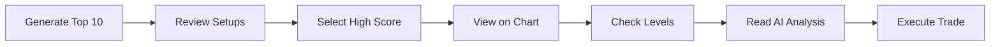

# 🤖 Institutional Trading Bot - Qwen3-Max AI Trading Lab

## 📋 Ümumi Məlumat

**Institutional Trading Bot** - Linda Raschke və Anthony Trongone metodologiyalarına əsaslanan professional AI trading sistemidir. Bu sistem chart üzərində SL/TP/Entry səviyyələrini göstərir və AI Co-Pilot ilə tam inteqrasiya olunub.

---

## 🎯 Əsas Xüsusiyyətlər

### 1. **Advanced Trading Chart**
- ✅ Real-time candlestick chart
- ✅ Entry, Stop Loss, Take Profit səviyyələri
- ✅ Risk/Reward zonları (vizual)
- ✅ Canlı qiymət xətti
- ✅ Interactive level tooltips
- ✅ Pip hesablamaları

### 2. **AI Co-Pilot İnteqrasiyası**
- ✅ Qwen3-Max AI analizi
- ✅ Real-time insights stream
- ✅ Active setup analysis
- ✅ Confidence scoring
- ✅ One-click execution

### 3. **Top 10 Setups**
- ✅ AI-powered setup generation
- ✅ Score-based ranking (0-100)
- ✅ Expandable details
- ✅ Quick chart view
- ✅ Enable/disable toggle

### 4. **Risk Management**
- ✅ Multiple TP levels (TP1, TP2, TP3)
- ✅ Dynamic R:R calculation
- ✅ Pip-based risk measurement
- ✅ Visual risk zones

---

## 🚀 İstifadə Təlimatı

### Addım 1: Səhifəyə Giriş

1. Sidebar-dan **"Institutional Bot"** seçin
2. Və ya URL-ə birbaşa gedin: `/institutional-bot`

### Addım 2: Setup Seçimi

**Setups Tab-ında:**
1. Top 10 setups siyahısını görün
2. Hər setup üçün score, symbol, timeframe məlumatı var
3. **Eye icon** (👁️) - Chart-da göstərmək üçün
4. **Chevron icon** (▼) - Detallı məlumat üçün

**Expanded Details:**
- Entry Price
- Stop Loss (-50 pips)
- Take Profit 1 (+75 pips)
- Take Profit 2 (+150 pips)
- Take Profit 3 (+225 pips)
- Risk:Reward ratio (1:4.5)

### Addım 3: Chart Görünüşü

**Charts Tab-ına keçin:**
1. Seçilmiş setup avtomatik chart-da göstərilir
2. Mavi xətt = Entry Level
3. Qırmızı xətt = Stop Loss
4. Yaşıl xətlər = Take Profit levels (TP1, TP2, TP3)
5. Sarı xətt = Current Price

**Interactive Features:**
- Hər səviyyənin üzərinə mouse apardıqda tooltip görünür
- Pip məsafələri və R:R nisbətləri göstərilir
- Risk/Reward zonaları rənglənir (yaşıl/qırmızı)

### Addım 4: AI Co-Pilot

**Sağ panel:**
- **Active Setup Analysis** - Seçilmiş setup haqqında AI təhlili
- **Live Insights** - Real-time AI bildirişləri
- **Execute** button - Bir kliklə icra
- **Copy** button - Setup məlumatını kopyala

---

## 📊 Chart Səviyyələri İzahı

### Entry Level (Mavi)
```
Price: 1.0850
Type: Market Entry
Action: BUY/SELL
```

### Stop Loss (Qırmızı)
```
Price: 1.0800
Distance: -50 pips
Risk: 1R
```

### Take Profit Levels (Yaşıl)

**TP1 (Conservative):**
```
Price: 1.0925
Distance: +75 pips
Reward: 1.5R
```

**TP2 (Moderate):**
```
Price: 1.1000
Distance: +150 pips
Reward: 3R
```

**TP3 (Aggressive):**
```
Price: 1.1075
Distance: +225 pips
Reward: 4.5R
```

---

## 🎨 Vizual Elementlər

### Rəng Kodları

| Element | Rəng | Mənası |
|---------|------|--------|
| Entry Line | 🔵 Mavi | Giriş nöqtəsi |
| Stop Loss | 🔴 Qırmızı | Risk limiti |
| Take Profit | 🟢 Yaşıl | Mənfəət hədəfləri |
| Current Price | 🟡 Sarı | Cari qiymət |
| Risk Zone | 🔴 Açıq qırmızı | Zərər zonası |
| Reward Zone | 🟢 Açıq yaşıl | Mənfəət zonası |

### Score Rəngləri

- **90-100**: 🟢 Yaşıl (Excellent)
- **80-89**: 🔵 Mavi (Good)
- **70-79**: 🟡 Sarı (Fair)
- **<70**: 🔴 Qırmızı (Poor)

---

## 🔧 Funksionallıq

### Setup Management

```javascript
// Enable/Disable Setup
onClick: Toggle setup ON/OFF

// View on Chart
onClick: Switch to Charts tab + Load setup

// Expand Details
onClick: Show/Hide detailed information
```

### Chart Interactions

```javascript
// Hover on Level
onMouseEnter: Show tooltip with details

// Click Setup Card
onClick: Load setup on chart

// Toggle Levels
onClick: Show/Hide all levels
```

---

## 📈 Nümunə Setup

```json
{
  "name": "Trend-Follow Breakout",
  "symbol": "EUR/USD",
  "timeframe": "4H",
  "score": 92,
  "confidence": "High",
  "entry": 1.0850,
  "stopLoss": 1.0800,
  "takeProfit1": 1.0925,
  "takeProfit2": 1.1000,
  "takeProfit3": 1.1075,
  "riskReward": 4.5,
  "rationale": "Breakout above 20EMA + volume spike > 1.5x avg"
}
```

---

## 🎯 AI Co-Pilot Insights

### Signal Types

**🔵 SIGNAL**
- Trading opportunities
- Entry/exit recommendations
- Technical analysis

**🔴 RISK**
- Risk warnings
- Portfolio alerts
- Drawdown notifications

**🟡 INFO**
- Market updates
- Economic events
- General information

### Confidence Levels

- **85-100%**: High confidence
- **70-84%**: Medium confidence
- **<70%**: Low confidence

---

## 💡 Pro Tips

### 1. Setup Selection
- Yüksək score-lu (>85) setups seçin
- "High" confidence-li setups prioritet verin
- Timeframe-i trading style-ınıza uyğun seçin

### 2. Risk Management
- Həmişə Stop Loss istifadə edin
- Multiple TP levels qoyun (partial exits)
- Risk:Reward minimum 1:2 olsun

### 3. Chart Analysis
- Bütün səviyyələri chart-da yoxlayın
- Risk/Reward zonalarına diqqət edin
- Current price-ın entry-yə yaxınlığını izləyin

### 4. AI Insights
- Real-time insights-ları oxuyun
- Confidence score-lara əhəmiyyət verin
- Signal və Risk alerts-ləri izləyin

---

## 🔄 Workflow



### Detailed Steps:

1. **Generate Top 10 Setups**
   - Click "Generate Top 10" button
   - Wait for AI analysis (3 seconds)
   - Review generated setups

2. **Review & Filter**
   - Sort by score
   - Check confidence levels
   - Read rationale

3. **Chart Analysis**
   - Click Eye icon
   - View levels on chart
   - Check R:R ratio

4. **AI Validation**
   - Read Co-Pilot analysis
   - Check confidence score
   - Review insights

5. **Execution**
   - Click Execute button
   - Or copy setup details
   - Or export to platform

---

## 🎓 Metodologiya

### Linda Raschke Principles
- Trend following
- Breakout strategies
- Volume confirmation
- Risk management

### Anthony Trongone Approach
- Institutional order flow
- Liquidity analysis
- Smart money concepts
- Market structure

### AI Enhancement
- Pattern recognition
- Probability scoring
- Real-time analysis
- Adaptive learning

---

## 📱 Keyboard Shortcuts

| Shortcut | Action |
|----------|--------|
| `Cmd/Ctrl + K` | Open Command Palette |
| `Tab` | Switch between tabs |
| `E` | Toggle levels visibility |
| `Esc` | Close expanded details |

---

## 🔗 İnteqrasiyalar

### Mövcud Sistemlər
- ✅ AI Co-Pilot
- ✅ Trade Journal
- ✅ Backtesting Engine
- ✅ Paper Trading
- ✅ Risk Control Center
- ✅ Strategy Builder

### Gələcək İnteqrasiyalar
- 🔄 Real broker connection
- 🔄 Live data feeds
- 🔄 Automated execution
- 🔄 Performance tracking

---

## 📊 Performance Metrics

Sistem aşağıdakı metrikləri izləyir:

- Daily P&L
- Win Rate
- Sharpe Ratio
- Max Drawdown
- Average R:R
- Total Trades
- Active Positions
- Risk Utilization

---

## 🛠️ Texniki Detallar

### Components
- `InstitutionalTradingBotProfile.jsx` - Main page
- `AdvancedTradingChart.jsx` - Chart component
- `ChartWorkbench.jsx` - Chart tools
- `StrategyBuilder.jsx` - Strategy creation
- `RiskControlCenter.jsx` - Risk management

### Technologies
- React 18
- Framer Motion (animations)
- SVG (chart rendering)
- Lucide Icons
- Tailwind CSS

---

## 🎉 Nəticə

**Institutional Trading Bot** professional trader və institutlar üçün hazırlanmış tam funksional AI trading sistemidir. Chart üzərində vizual səviyyələr, AI Co-Pilot inteqrasiyası və real-time insights ilə trading prosesini asanlaşdırır.

**Əsas Üstünlüklər:**
- 📊 Professional chart visualization
- 🤖 AI-powered analysis
- 🎯 Clear entry/exit levels
- 📈 Risk/Reward optimization
- ⚡ Real-time insights
- 🔧 Full customization

---

**Uğurlu Trading! 🚀📈**

